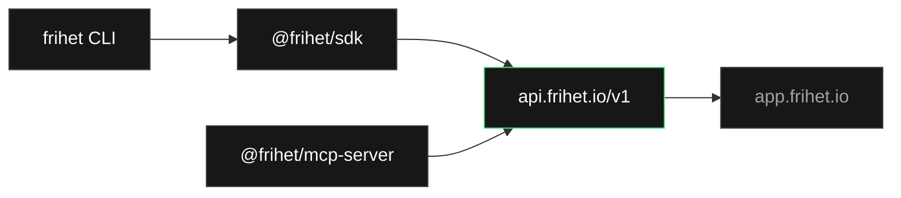

<p align="center">
  <picture>
    <source media="(prefers-color-scheme: dark)" srcset="assets/banner.svg">
    <source media="(prefers-color-scheme: light)" srcset="assets/banner-light.svg">
    
  </picture>
</p>

<p align="center">
  <b>Official TypeScript SDK + CLI for the <a href="https://frihet.io">Frihet</a> API.</b><br>
  <sub>Invoices, expenses, clients, products, quotes, webhooks, tax intelligence — all from code.</sub>
</p>

<p align="center">
  <a href="https://www.npmjs.com/package/@frihet/sdk"></a>
  <a href="https://www.npmjs.com/package/frihet"></a>
  <a href="https://github.com/Frihet-io/frihet-sdk/blob/main/LICENSE"></a>
  <a href="https://www.npmjs.com/package/@frihet/sdk"></a>
  <a href="https://docs.frihet.io/desarrolladores/api-rest"></a>
</p>

---

## SDK

```bash
npm install @frihet/sdk
```

```typescript
import Frihet from '@frihet/sdk';

const frihet = new Frihet({ apiKey: 'fri_...' });

// Create an invoice
const invoice = await frihet.invoices.create({
  clientName: 'Acme Corp',
  items: [{ description: 'Consulting', quantity: 10, unitPrice: 150 }],
});

// Mark as paid
await frihet.invoices.markPaid(invoice.id);

// Send PDF by email
await frihet.invoices.send(invoice.id, {
  recipientEmail: 'billing@acme.com',
});

// Quarterly tax summary (Modelo 303/130)
const q1 = await frihet.intelligence.quarterly('2026-Q1');
```

8 resources, full CRUD:

| Resource | Highlights |
|----------|-----------|
| `frihet.invoices` | create, send, pdf, markPaid, search, batch |
| `frihet.expenses` | create, categorize, search, batch |
| `frihet.clients` | CRM pipeline stages, fiscal zones, tax IDs |
| `frihet.vendors` | supplier management, search |
| `frihet.products` | catalog with SKU, tax rates |
| `frihet.quotes` | create, send, pdf |
| `frihet.webhooks` | CRUD + HMAC signature verification |
| `frihet.intelligence` | business context, monthly P&L, quarterly taxes |

<details>
<summary><strong>Error handling</strong></summary>

```typescript
import Frihet, { NotFoundError, RateLimitError, ValidationError } from '@frihet/sdk';

try {
  await frihet.invoices.retrieve('inv_123');
} catch (err) {
  if (err instanceof NotFoundError) {
    // 404 — resource doesn't exist
  } else if (err instanceof RateLimitError) {
    // 429 — auto-retried 3x, still exceeded
    console.log(`Retry after ${err.retryAfter}s`);
  } else if (err instanceof ValidationError) {
    // 400 — check err.details for field errors
  }
}
```

</details>

<details>
<summary><strong>Webhook verification</strong></summary>

```typescript
import { Webhooks } from '@frihet/sdk';

// In your webhook handler
const isValid = Webhooks.verifySignature(
  rawBody,                              // request body as string
  req.headers['x-frihet-signature'],    // sha256=... header
  process.env.WEBHOOK_SECRET,
);
```

</details>

<details>
<summary><strong>Per-request options</strong></summary>

```typescript
// Idempotency key for safe retries
await frihet.invoices.create(data, {
  idempotencyKey: 'order-12345',
  timeout: 60000,
});
```

</details>

---

## CLI

```bash
npm install -g frihet
```

```bash
$ frihet login
API key: fri_****
OK Authenticated as Viktor (Frihet Pro)

$ frihet invoices create --client "Acme Corp" --item "Consulting,10,150" --tax 21
OK Invoice FRI-2026-0042 created (EUR 1,815.00)

$ frihet invoices list --status overdue
Number       Client       Amount         Status    Due
FRI-2026-38  Acme Corp    EUR 800.00     overdue   12 days ago
FRI-2026-41  Beta Ltd     EUR 1,200.00   overdue   5 days ago

$ frihet status
Viktor Berthelius
Plan: Pro | 2026-03

Revenue:   EUR 15,200.00
Expenses:  EUR 3,400.00
Net:       EUR 11,800.00

Overdue:   4 invoices (EUR 3,200.00)

Top clients:
  Acme Corp: EUR 8,500.00
  Beta Ltd: EUR 4,200.00
```

---

## Architecture



## Features

| | |
|---|---|
| **TypeScript-first** | Full types, autocompletion, `.d.ts` included |
| **Retry & backoff** | Auto-retry on 429, 500, 502, 503, 504 |
| **Idempotency** | Safe retries via `Idempotency-Key` header |
| **Dual output** | ESM + CommonJS, zero runtime dependencies |
| **HMAC verification** | Constant-time webhook signature validation |
| **Request tracking** | `X-Request-Id` attached to all errors |

## Packages

| Package | npm | Description |
|---------|-----|-------------|
| [`@frihet/sdk`](packages/sdk) | `npm i @frihet/sdk` | TypeScript API client |
| [`frihet`](packages/cli) | `npm i -g frihet` | Command-line interface |

## Ecosystem

| Package | Description |
|---------|-------------|
| [`@frihet/mcp-server`](https://github.com/Frihet-io/frihet-mcp) | MCP server for AI agents (35 tools, 8 resources, 7 prompts) |
| [REST API](https://docs.frihet.io/desarrolladores/api-rest) | OpenAPI 3.1 spec at `api.frihet.io/v1/openapi.json` |
| [Webhooks](https://docs.frihet.io/desarrolladores/webhooks) | Real-time event notifications with HMAC-SHA256 |

## Links

[Documentation](https://docs.frihet.io) &#8226; [API Reference](https://api.frihet.io/v1/openapi.json) &#8226; [MCP Server](https://github.com/Frihet-io/frihet-mcp) &#8226; [Website](https://frihet.io)

## License

[MIT](LICENSE)
